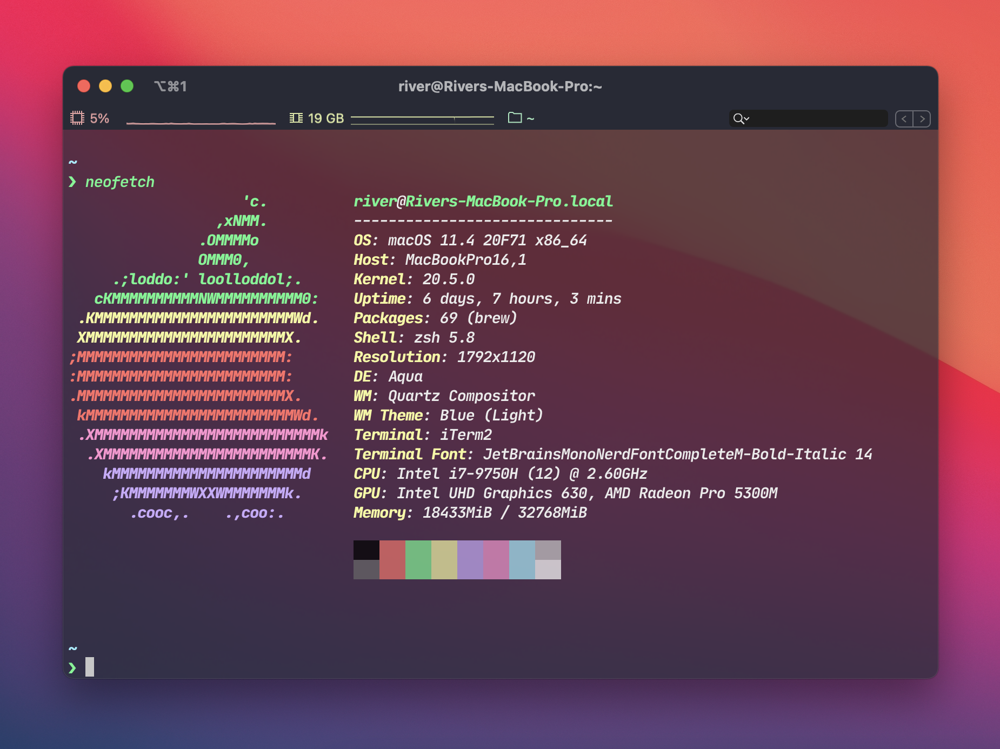

# 快速安装一个漂亮强大的 [iTerm 2](https://iterm2.com)

> 你的 mac 重装系统后应该执行的第一条命令

修改自 KingFalse 的 [ohmyiterm2](https://github.com/KingFalse/ohmyiterm2)，仓库内不再存放应用、插件及字体文件，安装时直接从官方下载

### 快速安装
` sh -c "$(curl -fsSL https://raw.githubusercontent.com/jonwn/ohmyiterm2/main/install.sh)"`

### 屏幕预览

### 它安装了什么
* [iTerm2](https://iterm2.com/)
* [Dracula for iTerm 2](https://github.com/dracula/iterm) 主题
* [JetBrains Mono Patched Font](https://github.com/ryanoasis/nerd-fonts)
* [Oh My Zsh](https://github.com/ohmyzsh/ohmyzsh)
* Oh My Zsh 插件
  * [git-open](https://github.com/paulirish/git-open)
  * [zsh-autosuggestions](https://github.com/zsh-users/zsh-autosuggestions)
  * [zsh-syntax-highlighting](https://github.com/zsh-users/zsh-syntax-highlighting)
  * [autojump](https://github.com/wting/autojump)
  * [starship](https://starship.rs/)
